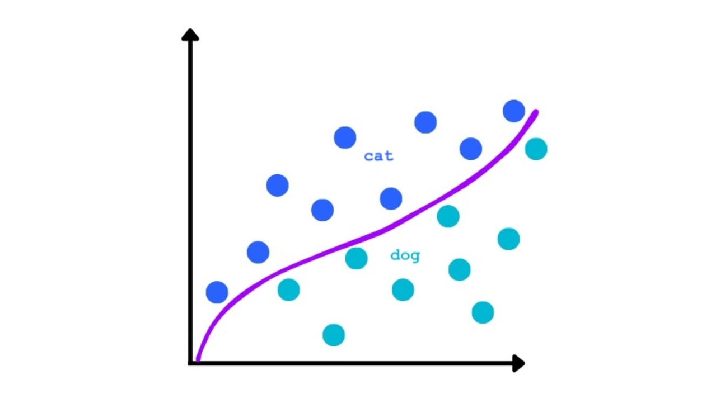
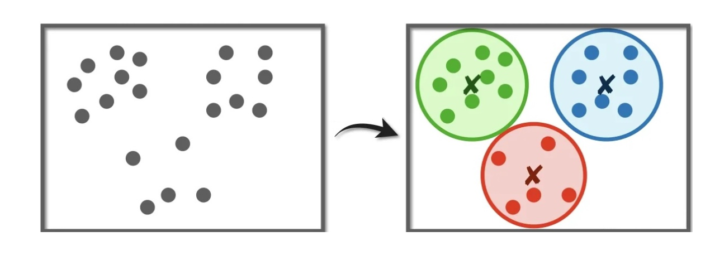
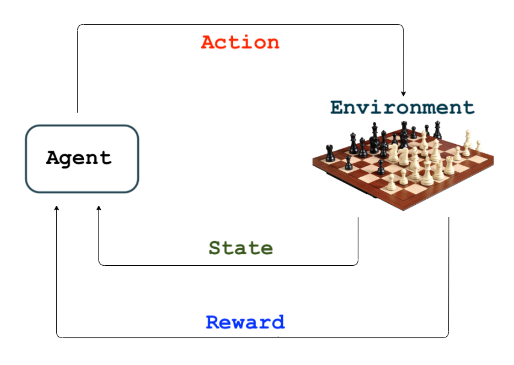

# Types of Machine Learning

Machine learning is generally categorized into three main types:

---

**Supervised Learning**

In supervised learning, we are given a dataset of labeled examples:

$\mathbb{D} = \{ (x_n, y_n) : n = 1, \dots, N \}$

- $x_n$: input (e.g., feature vector)  
- $y_n$: corresponding label or output  
- **Goal**: Learn a function $f(x) \approx y$ that generalizes to new data.

Examples:  
- Classification (e.g., spam detection)  
- Regression (e.g., house price prediction)

  

---

**Unsupervised Learning**

In this setting, the dataset contains **only inputs**, with no labels:

$\mathbb{D} = \{ x_n : n = 1, \dots, N \}$

- **Goal**: Discover hidden patterns or structures in the data.  
- Examples include:
  - Clustering (e.g., customer segmentation)  
  - Dimensionality reduction (e.g., PCA)

  

---

**Reinforcement Learning**

In reinforcement learning, the agent learns from sequences of interactions:

$\mathbb{D} = \{ \{ (a_n^t, s_n^t, r_n^t) : t = 1, \dots \} : n = 1, \dots, N \}$

- $s_n^t$: state at time $t$  
- $a_n^t$: action taken at time $t$  
- $r_n^t$: reward received at time $t$  

- **Goal**: Learn a policy to maximize cumulative reward through trial and error.

Applications include robotics, game playing, and adaptive systems.

  

---
