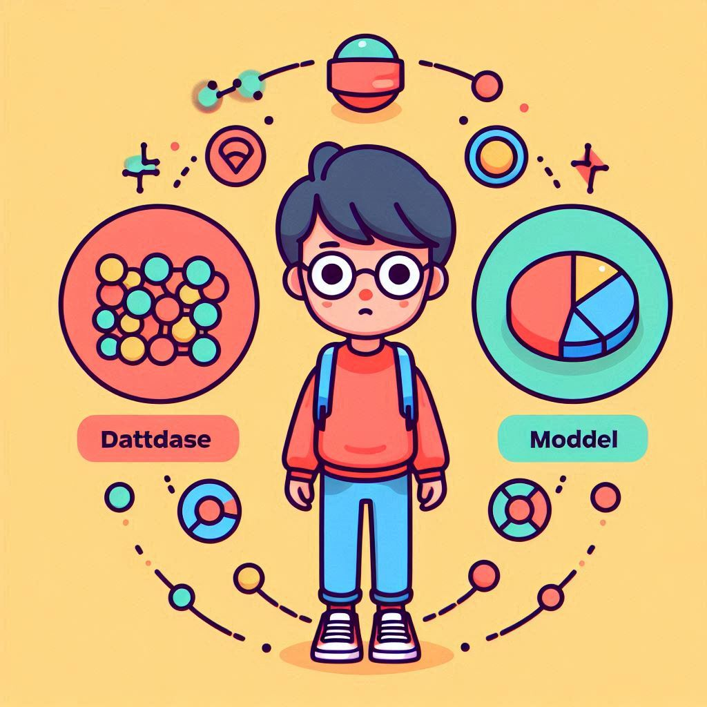

# Introduction to Machine Learning

Machine Learning (ML) is a subset of artificial intelligence that focuses on designing algorithms that can learn from data and make predictions or decisions without being explicitly programmed.

 

**What is Machine Learning?**

At its core, ML involves using data to automatically improve a model's performance at a task. Rather than coding specific instructions, we allow the algorithm to "learn" the pattern from examples.

 

**Types of Machine Learning**

- **Supervised Learning**: Learning from labeled data (e.g., classification, regression).  
- **Unsupervised Learning**: Learning from unlabeled data (e.g., clustering, dimensionality reduction).  
- **Reinforcement Learning**: Learning by interacting with an environment and receiving feedback in the form of rewards or penalties.

 

**Typical Workflow of ML**

1. Data collection and preprocessing  
2. Model selection and training  
3. Evaluation and validation  
4. Deployment and monitoring

 

**Key Components of an ML System**

In any ML system, there are three key components:

  

**Dataset**

A dataset consists of examples (data points) used to train and evaluate models. These examples may include:

- **Inputs (features)**: e.g., images, text, sensor data  
- **Outputs (labels)**: e.g., categories, values, actions  

**Model**

The model is a mathematical function or structure (e.g., linear function, neural network) that maps inputs to outputs.

- It contains **parameters** that are adjusted during training  
- The goal is to learn the “best” parameters to make accurate predictions  

**Learning Objective**

The model is trained to minimize some **loss function**, which measures how wrong its predictions are.

- Training is an optimization process  
- Evaluation ensures the model generalizes well to new data  

Together, these components form the foundation for all modern machine learning systems.
