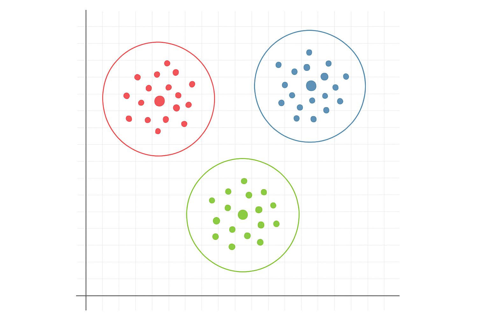

# Clustering Overview

Clustering is one of the most fundamental tasks in **unsupervised learning**. It aims to divide a set of data points into groups, called **clusters**, such that points within the same cluster are more similar to each other than to points in other clusters.

  

 

**Mathematical Formulation**

Let the dataset be defined as:

$$
\mathbb{D} = \{x_1, x_2, \dots, x_N\} \subset \mathbb{R}^d
$$

where each $x_i$ is a $d$-dimensional feature vector.

Clustering is the task of partitioning $\mathbb{D}$ into $K$ disjoint subsets $\mathcal{C}_1, \mathcal{C}_2, \dots, \mathcal{C}_K$ such that:

- $\mathcal{C}_k \cap \mathcal{C}_j = \emptyset$ for all $k \neq j$
- $\bigcup_{k=1}^K \mathcal{C}_k = \mathbb{D}$

Each $\mathcal{C}_k$ represents a **cluster**. The goal is to ensure **intra-cluster similarity** (points in the same cluster are close) and **inter-cluster dissimilarity** (points in different clusters are far apart).

 

**Cluster Assignment Function**

We define a cluster assignment function:

$$
c: \mathbb{D} \rightarrow \{1, \dots, K\}
$$

that assigns each point $x_n$ to a cluster label $c_n = c(x_n) \in \{1, \dots, K\}$.

Alternatively, the cluster assignments can be represented using **one-hot encoding**:

$$
z_{nk} =
\begin{cases}
1 & \text{if } x_n \in \mathcal{C}_k \\
0 & \text{otherwise}
\end{cases}
$$

where $z_n \in \{0, 1\}^K$ and $\sum_{k=1}^{K} z_{nk} = 1$

 

**Similarity and Distance Metrics**

To define the quality of clustering, we rely on a **distance metric** or **similarity measure**, often based on:

- **Euclidean distance**: $d(x_i, x_j) = \|x_i - x_j\|_2$
- **Cosine similarity**: $\text{sim}(x_i, x_j) = \frac{x_i^\top x_j}{\|x_i\|\|x_j\|}$

Different clustering algorithms may use different metrics depending on the task and data nature.

 

**Hard vs Soft Clustering**

- **Hard Clustering**: Each data point belongs to exactly one cluster. This is reflected by the one-hot encoded $z_n$ vectors.
- **Soft Clustering**: Each data point can belong to multiple clusters with probabilities or degrees of membership. This leads to a soft assignment matrix $Z \in [0,1]^{N \times K}$ with $\sum_{k=1}^{K} z_{nk} = 1$.

 

**Optimization Perspective**

Clustering can be formulated as an optimization problem:

$$
\min_{c} \ \sum_{n=1}^N \ell(x_n, c(x_n))
$$

where $\ell$ is a **loss function** measuring how well point $x_n$ fits into the assigned cluster. For example, K-means uses the squared Euclidean distance between a point and its assigned centroid.

More generally:

$$
\min_{Z, \Theta} \ \mathcal{L}(\mathbb{D}, Z, \Theta)
$$

where $\Theta$ represents model parameters (e.g., cluster centers), and $Z$ is the cluster assignment matrix.

 

This formulation allows clustering to be viewed through the lens of **optimization**, paving the way for model-based clustering approaches.

---

Next, we will explore one of the most widely used clustering algorithms — **K-M**
