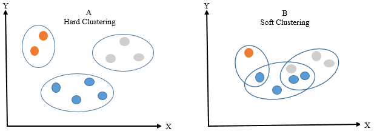

# Soft Clustering

Unlike hard clustering, where each data point is assigned to a single cluster, **soft clustering** allows a data point to belong to multiple clusters with varying degrees of membership. This probabilistic interpretation is more flexible and often more realistic for many practical applications.

  

---

**Motivation for Soft Clustering**

In many real-world scenarios, the boundary between clusters is not well defined. For example, a document may be about both politics and economics, or a user might belong to more than one interest group.

To capture this ambiguity, soft clustering models define **assignment weights** instead of discrete labels.

---

**Alternative Formulation of Clustering**

We can formulate clustering as learning a **mapping function** from input space to the set of possible cluster indices:

$$
f: \mathbb{R}^d \rightarrow \{1, 2, \dots, K\}
$$

In **soft clustering**, this becomes:

$$
f: \mathbb{R}^d \rightarrow \Delta^{K-1}
$$

where $\Delta^{K-1}$ is the $(K-1)$-simplex — the set of all $K$-dimensional vectors with non-negative entries that sum to 1.

This means that for a given point $x$, the model returns a **probability vector** over the $K$ clusters.

---

**Risk Minimization Perspective**

Clustering can also be framed as a **risk minimization** problem, similar to supervised learning but without ground-truth labels.

Let $f(x) \in \Delta^{K-1}$ be the soft assignment of $x$ to $K$ clusters.

We can define a surrogate loss $\ell(f(x))$ that reflects the clustering quality — for instance, how concentrated or separable the soft assignments are.

Then the clustering objective becomes:

$$
\min_{f \in \mathcal{F}} \mathbb{E}_{x \sim \mathbb{P}} [ \ell(f(x)) ]
$$

This is an **unsupervised expected risk minimization** formulation, where:
- $\mathbb{P}$ is the data distribution.
- $\mathcal{F}$ is the space of admissible soft assignment functions.
- $\ell$ is a surrogate loss encouraging desirable properties like cluster compactness or margin.

---

**Applications and Methods**

- **Gaussian Mixture Models (GMMs)**: Assign soft probabilities to components via EM.
- **Neural Networks**: Use softmax outputs to predict cluster probabilities.
- **Variational Methods**: Use Bayesian priors and posterior approximation for flexible soft assignments.

Soft clustering provides a rich framework for modeling complex data, especially when categories overlap or uncertainty is inherent.

