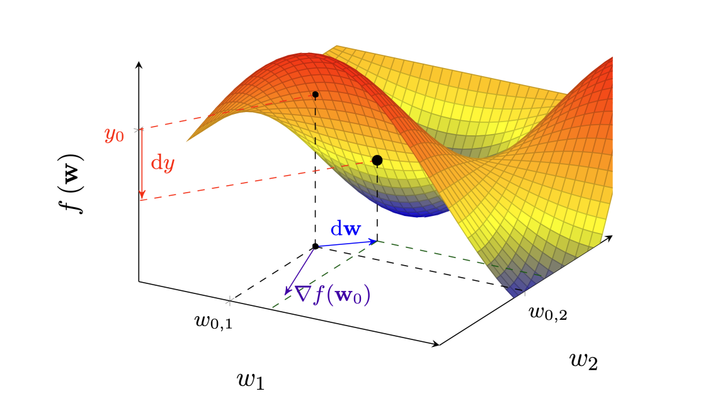
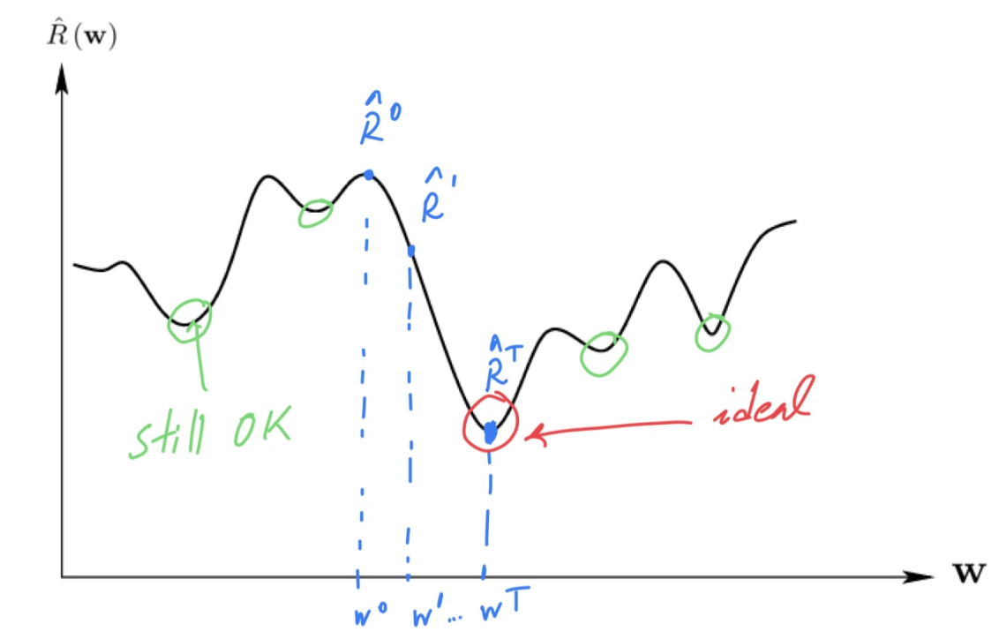

# Gradient Descent and Classification with Confidence

**Gradient Descent**

In most learning problems, a closed-form solution is not available.  
Instead, we approximate the minimizer of the empirical risk $\hat R(\mathbf{w})$ by iterative optimization.  

**Optimization Objective**

$$
\min_{\mathbf{w}} \ \hat R(\mathbf{w}).
$$

Here, $\mathbf{w}$ denotes the model parameters and $\hat R$ is the empirical risk.

---

**Algorithmic Structure**

We initialize parameters $\mathbf{w}$ and perform repeated updates until convergence:

$$
\mathbf{w}^{t+1} \leftarrow \mathbf{w}^t + \eta \, \boldsymbol{\mu}^t,
$$

where $\eta$ is the **learning rate** (step size) and $\boldsymbol{\mu}^t$ is a search direction.

---

**Choice of Direction**

- In one dimension, the derivative indicates increase; moving in the **negative** direction decreases the function.  
- In higher dimensions, the gradient points to the direction of **steepest ascent**, while its negative indicates **steepest descent**.

Thus:

$$
\boldsymbol{\mu}^t = -\nabla \hat R(\mathbf{w}^t)
\quad \Rightarrow \quad
\mathbf{w}^{t+1} = \mathbf{w}^t - \eta \, \nabla \hat R(\mathbf{w}^t).
$$

  

---

**Stopping Criterion**

We terminate when updates become negligible:

$$
\|\mathbf{w}^{t+1} - \mathbf{w}^t\|^2 \leq \epsilon
\quad \Longleftrightarrow \quad
\|\nabla \hat R(\mathbf{w}^t)\|^2 \approx 0.
$$

This corresponds to reaching a **stationary point** (minimum, maximum, or saddle).  
Descent methods avoid maxima but may settle at minima or pass through saddle points.

  

---

**Gradient Descent Algorithm**

1. Select tolerance $\epsilon$ and learning rate $\eta$.  
2. Initialize $\mathbf{w}^0$.  
3. Iterate updates:  

$$
\mathbf{w}^{t+1} = \mathbf{w}^t - \eta \nabla \hat R(\mathbf{w}^t).
$$

4. Stop when changes are small and return $\mathbf{w}^t$.  

> **Learning rate matters**: too large $\rightarrow$ divergence; too small $\rightarrow$ very slow convergence.

---

**Example: Linear Regression**

For squared loss:

$$
\hat R(\mathbf{w}) = \frac{1}{N}\|\mathbf{X}^\top \mathbf{w} - \mathbf{v}\|^2.
$$

Gradient:

$$
\nabla \hat R(\mathbf{w}^t) = \frac{2}{N}\big(\mathbf{X}\mathbf{X}^\top \mathbf{w}^t - \mathbf{X}\mathbf{v}\big).
$$

Update:

$$
\mathbf{w}^{t+1} = \mathbf{w}^t - \frac{2\eta}{N}\big(\mathbf{X}\mathbf{X}^\top \mathbf{w}^t - \mathbf{X}\mathbf{v}\big).
$$

At convergence:

$$
\mathbf{X}\mathbf{X}^\top \mathbf{w}^t \approx \mathbf{X}\mathbf{v}
\quad \Rightarrow \quad
\mathbf{w}^t \approx (\mathbf{X}\mathbf{X}^\top)^{-1}\mathbf{X}\mathbf{v}.
$$

This matches the analytic least-squares solution.

---

**Notes**

- Convergence is guaranteed to a **global** minimum if $\hat R$ is convex (e.g., linear/logistic regression).  
- For non-convex risks, we converge to local minima.  
- The learning rate $\eta$ critically affects both convergence speed and stability.

---

**References**

- Goodfellow et al., *Deep Learning*, Ch. 4.  
- Bishop, *Pattern Recognition and Machine Learning*, Ch. 5.  
- Hastie, Tibshirani, Friedman, *ESL*, Ch. 10.
