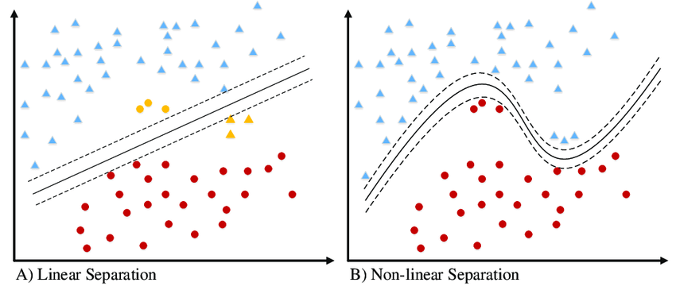
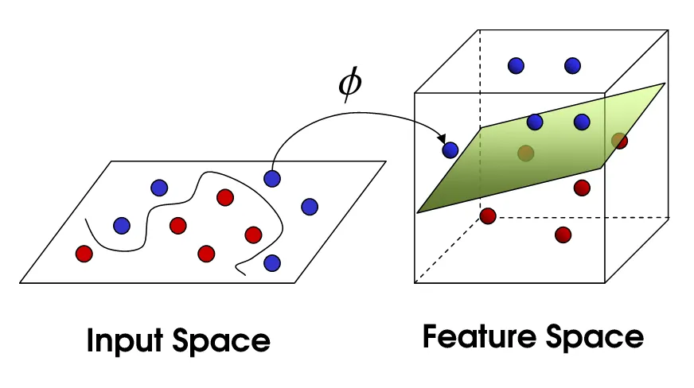

# Nonlinear Classification and the Kernel Trick

**Limitation of Linear SVC**

The Support Vector Classifier (SVC) is a **linear classifier**.  
It only succeeds when the data are **linearly separable**.

  

But many real-world datasets are not linearly separable.  
How do we extend SVC to nonlinear decision boundaries?

---

**Dimension Expansion**

Idea: transform data into a higher-dimensional feature space where it becomes linearly separable.

For example:

$$
x \mapsto \tilde{\mathbf{x}} = \varphi(x) = 
\begin{bmatrix}
x \\
x^2
\end{bmatrix}.
$$

Then train a linear SVC in this feature space:

$$
y_n = \operatorname{sign}\!\left(\mathbf{w}^\top \varphi(\mathbf{x}_n)\right).
$$

**Visualization:**

  

---

**General Embedding**

Given data

$$
\mathcal{D} = \{(\mathbf{x}_n, v_n) : n=1,\ldots,N\}, \quad \mathbf{x}_n \in \mathbb{R}^d,
$$

define an embedding function

$$
\varphi:\ \mathbb{R}^d \to \mathbb{R}^D, \quad D > d,
$$

and solve the SVC in the higher-dimensional feature space.

Prediction:

$$
y = \operatorname{sign}\!\left(\mathbf{w}^\top \varphi(\mathbf{x})\right).
$$

---

**Kernel Formulation**

Recall that the SVC dual uses only **inner products**:

$$
\max_{\boldsymbol{\lambda}\ge 0} \ \sum_{n=1}^N \lambda_n 
- \tfrac{1}{4} \sum_{n=1}^N\sum_{m=1}^N \lambda_n \lambda_m v_n v_m \, \mathbf{x}_n^\top \mathbf{x}_m .
$$

With embedding:

$$
\max_{\boldsymbol{\lambda}\ge 0} \ \sum_{n=1}^N \lambda_n 
- \tfrac{1}{4} \sum_{n=1}^N\sum_{m=1}^N \lambda_n \lambda_m v_n v_m \, \varphi(\mathbf{x}_n)^\top \varphi(\mathbf{x}_m) .
$$

Prediction:

$$
y = \operatorname{sign}\!\left(\sum_{n=1}^N \lambda_n^\star v_n \, 
\varphi(\mathbf{x}_n)^\top \varphi(\mathbf{x})\right).
$$

---

**The Kernel Trick**

We do not need to compute $\varphi(\mathbf{x})$ explicitly.  
It is enough to compute inner products via a **kernel function**:

$$
K(\mathbf{x}_m,\mathbf{x}_n) 
= \varphi(\mathbf{x}_m)^\top \varphi(\mathbf{x}_n).
$$

Thus, both training and inference depend only on $K$, not on the explicit features.

---

**Support Vector Machine (SVM)**

An **SVM** is simply an SVC trained with a **kernel function**:

- Linear kernel → standard SVC.  
- Nonlinear kernels → nonlinear decision boundaries.  

---

**Famous Kernels**

- **Polynomial kernel** of order $p$:

$$
K(\mathbf{x}_n,\mathbf{x}_m) = (\mathbf{x}_n^\top \mathbf{x}_m + c)^p .
$$

- **Gaussian (RBF) kernel**:

$$
K(\mathbf{x}_n,\mathbf{x}_m) = \exp\!\left(-\frac{\|\mathbf{x}_n-\mathbf{x}_m\|^2}{\sigma}\right).
$$

RBF kernels correspond to **infinite-dimensional embeddings** (via Taylor expansion).

---

**Representation Learning**

- Choosing a kernel is equivalent to **feature engineering**.  
- Predefined kernels fix the embedding function $\varphi$.  
- Alternatively, one can **learn kernels** jointly with the classifier:

$$
\min_{\mathbf{w},\,\boldsymbol{\theta}} \ \hat R(\mathbf{w},\boldsymbol{\theta}),
\qquad 
K_\theta(\mathbf{x}_m,\mathbf{x}_n) \text{ parameterized.}
$$

This is called **representation learning**.

---

**Neural Networks and Kernels**

Deep neural networks can be viewed as **learned embeddings** $\varphi_\theta(\cdot)$,  
which induce powerful kernels:

$$
K_\theta(\mathbf{x}_m,\mathbf{x}_n) 
= \varphi_\theta(\mathbf{x}_m)^\top \varphi_\theta(\mathbf{x}_n).
$$

Hence, NNs provide excellent representations, connecting SVMs to modern deep learning.

