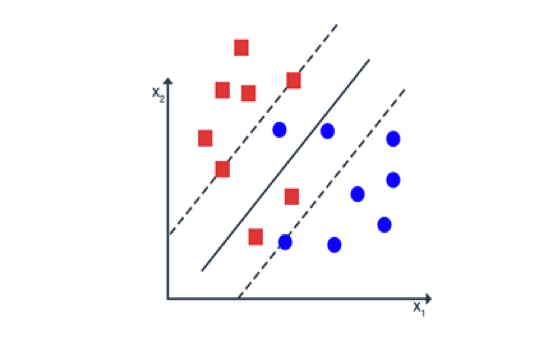
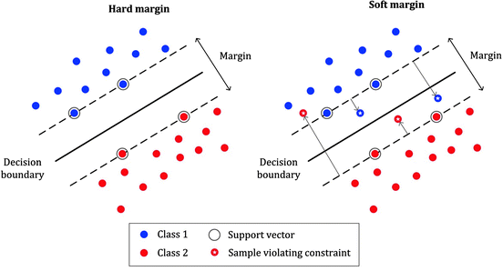

# SVC with Soft Margin

**Challenge with Hard-Margin SVC**

The hard-margin Support Vector Classifier requires perfect separability.  
It is **sensitive to outliers**: even a single mislabeled or atypical data point can destroy separability.

  

---

**Soft Margin: Idea**

To overcome this, we allow some violations of the margin constraints.  
Introduce **slack variables** $\xi_n \geq 0$ to quantify margin violations.  

---

**Soft Margin: Trade-Off**

- Large margin improves generalization.  
- Slack variables permit controlled violations.  
- A parameter $C>0$ balances the trade-off between **margin size** and **classification errors**.

  

---

**Soft Margin Formulation**

The optimization problem becomes:

$$
\min_{\mathbf{w},\,\boldsymbol{\xi}} \ \|\mathbf{w}\|^2 + C \sum_{n=1}^N \xi_n
$$

subject to

$$
v_n \,\mathbf{w}^\top \mathbf{x}_n \ \geq\ 1 - \xi_n,
\qquad
\xi_n \geq 0,
\quad n=1,\dots,N .
$$

- If $\xi_n = 0$: point is correctly classified and outside the margin.  
- If $0 < \xi_n < 1$: point lies inside the margin.  
- If $\xi_n \geq 1$: point is misclassified.

---

**Dual Problem**

By introducing Lagrange multipliers and eliminating $\mathbf{w}$, we obtain the dual:

$$
\max_{\boldsymbol{\lambda}} \ 
\sum_{n=1}^N \lambda_n 
- \tfrac{1}{4} \sum_{n=1}^N \sum_{m=1}^N 
\lambda_n \lambda_m v_n v_m \, \mathbf{x}_n^\top \mathbf{x}_m
$$

subject to

$$
0 \le \lambda_n \le C, \qquad n=1,\ldots,N .
$$

The upper bound $C$ on $\lambda_n$ arises from the slack variables.

---

**Classifier Solution**

The optimal weight vector is

$$
\mathbf{w}^\star = \tfrac{1}{2} \sum_{n=1}^N \lambda_n^\star v_n \mathbf{x}_n .
$$

Classification of a new sample $\mathbf{x}$ uses:

$$
y = \operatorname{sign}\!\left( \sum_{n=1}^N \lambda_n^\star v_n \mathbf{x}_n^\top \mathbf{x} \right).
$$

- If $0 < \lambda_n^\star < C$: support vector lies **on the margin**.  
- If $\lambda_n^\star = C$: support vector corresponds to a **violation** (inside margin or misclassified).  
- If $\lambda_n^\star = 0$: the point is **inactive**.

