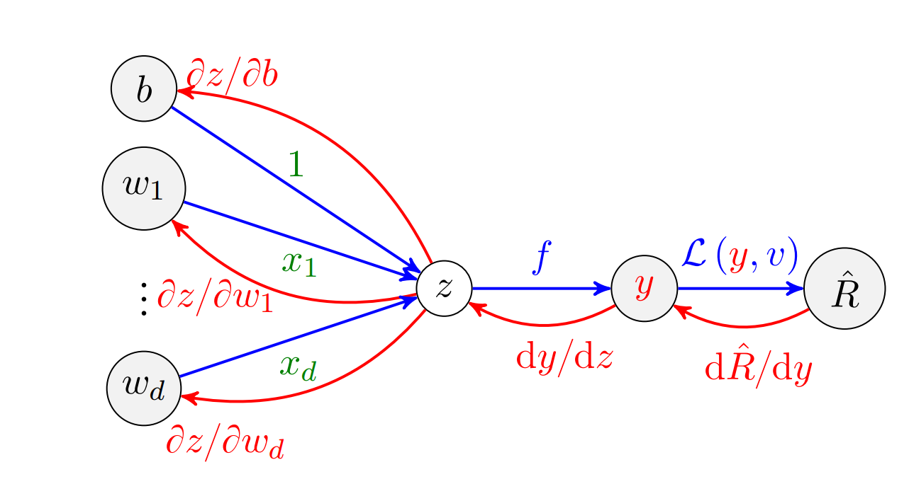

# Backpropagation Algorithm

**Motivation**

Training a neural network requires adjusting the weights to minimize a loss function.  
Since neural networks are built from multiple layers of compositions, we need an efficient way to compute gradients.  
This is achieved through the **backpropagation algorithm**, which systematically applies the chain rule.

---

**Chain Rule of Calculus**

For a scalar loss $\mathcal{L}$ depending on intermediate variables, the gradient is computed recursively:  

$$
\frac{\partial \mathcal{L}}{\partial x} = 
\frac{\partial \mathcal{L}}{\partial y} \cdot
\frac{\partial y}{\partial x}.
$$

This principle extends naturally to vectors and matrices, enabling efficient gradient flow through deep networks.

---

**Error Signal**

In neural networks, we define an **error signal** $\delta$ at each layer.  
For layer $\ell$ with activation function $f(\cdot)$:

$$
\delta^\ell = \frac{\partial \mathcal{L}}{\partial a^\ell}
= \frac{\partial \mathcal{L}}{\partial h^\ell} \cdot f'(a^\ell),
$$

where  
- $a^\ell = \mathbf{W}^\ell h^{\ell-1} + b^\ell$ (pre-activation),  
- $h^\ell = f(a^\ell)$ (post-activation).  

---

**Recursive Gradient Computation**

The backpropagation recurrence is:

- **Output layer ($L$):**

$$
\delta^L = \nabla_{h^L}\,\mathcal{L} \odot f'(a^L).
$$

- **Hidden layers ($\ell < L$):**

$$
\delta^\ell = \big( (W^{\ell+1})^\top \delta^{\ell+1} \big) \odot f'(a^\ell).
$$

Here $\odot$ denotes element-wise multiplication.

---

**Weight and Bias Gradients**

Once $\delta^\ell$ is computed:

$$
\frac{\partial \mathcal{L}}{\partial W^\ell} = \delta^\ell (h^{\ell-1})^\top,
\qquad 
\frac{\partial \mathcal{L}}{\partial b^\ell} = \delta^\ell.
$$

Thus, gradients can be obtained efficiently layer by layer.

---

**Algorithm Steps**

1. **Forward pass:** compute activations $a^\ell, h^\ell$ for all layers.  
2. **Backward pass:** compute $\delta^L, \delta^{L-1}, \dots, \delta^1$.  
3. **Update parameters:**  

$$
W^\ell \leftarrow W^\ell - \eta \,\frac{\partial \mathcal{L}}{\partial W^\ell},
\qquad
b^\ell \leftarrow b^\ell - \eta \,\frac{\partial \mathcal{L}}{\partial b^\ell}.
$$

  

