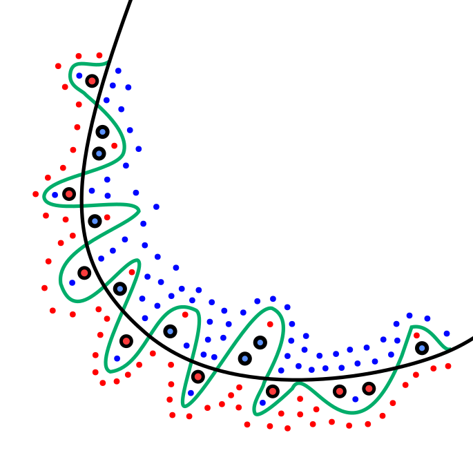

# Training Neural Networks - Expressivity and Overfitting

**Expressivity and Overfitting**

Neural networks are powerful function approximators, but their expressivity comes with challenges in controlling complexity and avoiding overfitting.

---

**Expressivity of Neural Networks**

- Universal Approximation Theorem:  
  A feedforward neural network with at least one hidden layer and nonlinear activations can approximate **any continuous function** on compact domains, given sufficient hidden units.  

- Deeper architectures can represent complex functions more efficiently than shallow ones.  
- However, increased depth and width expand the hypothesis space, raising the risk of overfitting.

---

**Overfitting Phenomenon**

- **Definition:** The model fits the training data very well but fails to generalize to unseen data.  
- **Symptoms:**  
  - Training error $\downarrow$ while validation error $\uparrow$.  
  - Model memorizes noise and outliers.  

  

---

**Bias–Variance Trade-Off**

- **High bias (underfitting):** Model too simple, poor training accuracy.  
- **High variance (overfitting):** Model too complex, poor generalization.  
- Goal: find balance between bias and variance via architecture and regularization.

  

---

**Strategies to Mitigate Overfitting**

- **Regularization:** $L_1$, $L_2$, weight decay.  
- **Dropout:** Randomly deactivate neurons during training.  
- **Early stopping:** Stop when validation error starts increasing.  
- **Data augmentation:** Enrich dataset with transformations.  
- **Cross-validation:** Ensure robustness of hyperparameter choices.  

