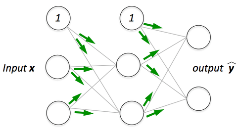

# Forward Propagation

**Concept**

Forward propagation refers to the process of **computing the output of a neural network** by passing input data through each layer, applying linear transformations followed by nonlinear activations.  

It is essentially the **evaluation phase** of the network given the parameters $(\mathbf{W}, \mathbf{b})$.  

  

---

**Mathematical Formulation**

For an input vector $\mathbf{x} \in \mathbb{R}^d$, an $\ell$-layer feedforward neural network (MLP) proceeds as follows:  

$$
\begin{aligned}
\mathbf{a}^1 &= \mathbf{W}^1 \mathbf{x} + \mathbf{b}^1, 
& \quad \mathbf{h}^1 = f(\mathbf{a}^1), \\
\mathbf{a}^2 &= \mathbf{W}^2 \mathbf{h}^1 + \mathbf{b}^2, 
& \quad \mathbf{h}^2 = f(\mathbf{a}^2), \\
&\;\;\vdots \\
\mathbf{a}^\ell &= \mathbf{W}^\ell \mathbf{h}^{\ell-1} + \mathbf{b}^\ell, 
& \quad \mathbf{y} = g(\mathbf{a}^\ell),
\end{aligned}
$$  

- $\mathbf{a}^j$: pre-activation vector at layer $j$,  
- $\mathbf{h}^j$: hidden representation (after activation),  
- $f(\cdot)$: nonlinear activation (ReLU, sigmoid, tanh, etc.),  
- $g(\cdot)$: output activation (e.g., identity, sigmoid, or softmax).  

---

**Layer-by-Layer Process**

1. **Linear Transformation**  
   Each layer computes a weighted sum of inputs:  
   $$
   \mathbf{a}^j = \mathbf{W}^j \mathbf{h}^{j-1} + \mathbf{b}^j.
   $$  

2. **Nonlinear Activation**  
   The activation function introduces **nonlinearity**, enabling the network to model complex relationships:  
   $$
   \mathbf{h}^j = f(\mathbf{a}^j).
   $$  

3. **Final Output**  
   After the last hidden layer, the output layer produces $\mathbf{y}$, used for regression or classification tasks.  

