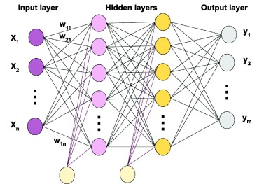

# Multilayer Perceptrons (MLPs)

**Motivation**

The perceptron is limited to **linearly separable problems**.  
To handle more complex decision boundaries, we introduce **Multilayer Perceptrons (MLPs)**, which stack layers of neurons with nonlinear activations.  

---

**Architecture**

An MLP consists of:
- **Input layer**: receives the raw features $\mathbf{x} \in \mathbb{R}^d$,  
- **Hidden layers**: multiple layers of neurons with nonlinear activation functions,  
- **Output layer**: produces predictions (regression outputs or class probabilities).  

Mathematically, for an $\ell$-layer MLP:

$$
\begin{aligned}
\mathbf{a}^1 &= \mathbf{W}^1 \mathbf{x} + \mathbf{b}^1, \quad \mathbf{h}^1 = f(\mathbf{a}^1), \\
\mathbf{a}^2 &= \mathbf{W}^2 \mathbf{h}^1 + \mathbf{b}^2, \quad \mathbf{h}^2 = f(\mathbf{a}^2), \\
&\;\;\vdots \\
\mathbf{a}^\ell &= \mathbf{W}^\ell \mathbf{h}^{\ell-1} + \mathbf{b}^\ell, \quad \mathbf{y} = g(\mathbf{a}^\ell),
\end{aligned}
$$  

where $f(\cdot)$ is a nonlinear activation (e.g., ReLU, sigmoid) and $g(\cdot)$ is the output function (e.g., identity for regression, softmax for classification).  

  

