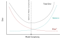

# Bias–Variance Tradeoff

The generalization error of a model can be decomposed into three components:

$$
\mathbb{E}[(y - v)^2] \approx \underbrace{(\bar{y} - \bar{v})^2}_{\text{Bias}^2} \;+\; \underbrace{\mathrm{Var}(y)}_{\text{Variance}} \;+\; \underbrace{\mathrm{Var}(v)}_{\text{Irreducible Error}}
$$

---

### Bias
- Measures the error introduced by **approximating a complex function** with a simpler model.
- High bias → model is too simple (**underfitting**).
- Example: Linear regression on highly nonlinear data.

---

### Variance
- Measures how much the model’s predictions vary with different training sets.
- High variance → model is too sensitive to training data (**overfitting**).
- Example: Deep network memorizing noise in the dataset.

---

### Irreducible Error (Bayes Error)
- Noise inherent in the data
- Cannot be reduced by any model, no matter how complex

---

### Tradeoff
- Reducing bias usually increases variance, and vice versa.
- Goal: Find a balance that minimizes the **expected generalization error**.

---

### Visualization

  

