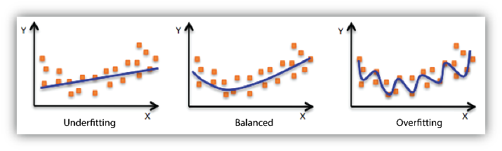

# Underfitting vs. Overfitting

When a model fails to generalize, two main scenarios arise:

---

### Overfitting
- **Definition:** The model learns the training data **too well**, including noise and irrelevant patterns.
- Symptoms:
  - Training loss is small
  - Validation/test loss is large
- Interpretation:
  - Model **memorizes** training data instead of learning general patterns
  - Poor performance on unseen data

---

### Underfitting
- **Definition:** The model fails to capture the underlying structure of the data.
- Symptoms:
  - Both training loss and validation loss are large
- Interpretation:
  - Model is too simple or improperly trained
  - Lacks the capacity to represent the data distribution

---

### Typical Behavior
- In modern **deep learning**, underfitting is less common.
- The dominant challenge is **overfitting**, especially with high-capacity neural networks.

---

### Visualization

  

- **Left:** Underfitting – model is too simple  
- **Middle:** Good fit – model generalizes well  
- **Right:** Overfitting – model is too complex, capturing noise  

