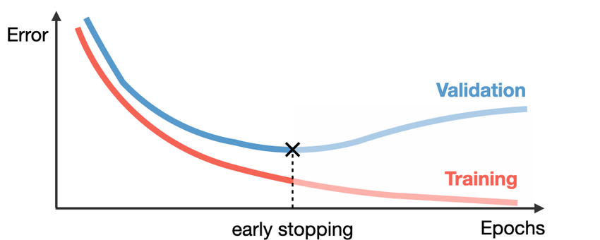
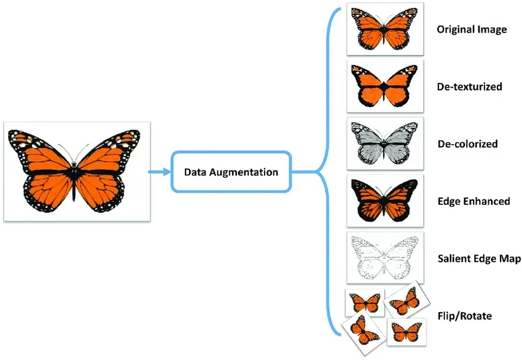

# Validation Methods

Validation methods are essential for assessing a model’s ability to **generalize**.  
They help in **model selection**, **hyperparameter tuning**, and **overfitting prevention**.

---

### Hyperparameter Tuning
- **Hyperparameters:** settings we choose before training (e.g., learning rate, depth, width, regularization strength).  
- Process:
  1. Train with initial hyperparameters.
  2. Evaluate on a **validation set**.
  3. Adjust hyperparameters and re-train if validation error is high.
- Search strategies:
  - **Grid search** – exhaustive but expensive.
  - **Random search** – more efficient in high dimensions.

---

### Early Stopping
- Monitor performance on a validation set after each epoch.
- Stop training when validation error stops improving.

  

- Prevents the model from overfitting while still learning enough from the data.

---

### Ensemble Methods
- Combine multiple models to reduce variance and improve generalization.  
- Given $m$ models with predictions $y_i$, the ensemble prediction is:

$$
y = \frac{1}{m} \sum_{i=1}^m y_i
$$

- Approaches:
  - **Bagging**: train the same model on different bootstrap samples.  
  - **Stacking**: combine different models trained on the same data.  
  - **Boosting**: sequentially re-train models, focusing on previously misclassified samples.  

---

### Data Augmentation
- Artificially enlarge the training set by generating new samples.  
- Examples:
  - Image transformations (rotations, flips, color jitter).  
  - Noise injection or random masking for tabular/time-series data.  

  

- Especially important in deep learning when data is scarce.

