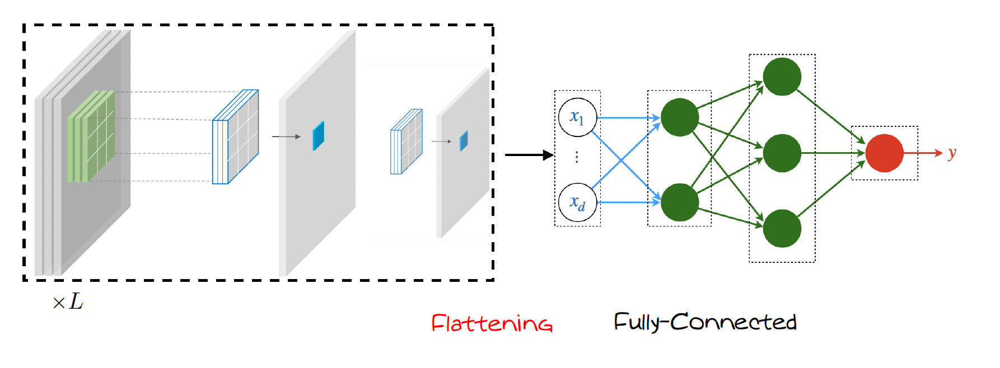

# Popular CNN Architectures 

  

CNNs have evolved with deeper and more efficient designs.  
Here are some landmark architectures:

---

**LeNet-5 (1998)**

- Designed for digit recognition  
- Early use of convolution, pooling, and ReLU

---

**AlexNet (2012)**

- First deep CNN to win ImageNet competition  
- Used ReLU, dropout, data augmentation

---

**VGGNet (2014)**

- Very deep (16–19 layers) with $3 \times 3$ filters  
- Simple and uniform design

---

**ResNet (2015)**

- Introduced **residual connections** to train extremely deep networks  
- Enabled training of 50+, 100+, 150+ layer CNNs

