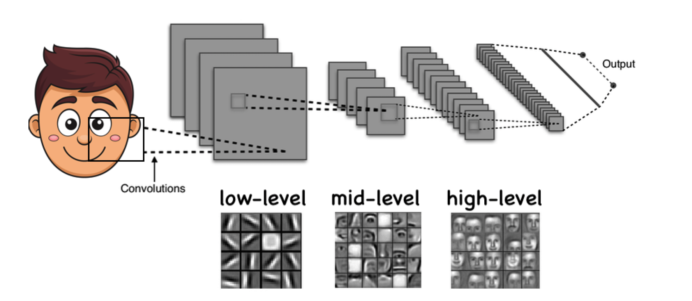

# Why Fully Connected Layers Are Not Enough
Fully connected (dense) layers treat all input features equally and independently.  
While effective for low-dimensional, structured inputs (e.g., tabular data), they struggle with high-dimensional inputs like images, audio, and signals.

---

**Loss of Structural Information**

In domains like vision, speech, or sensor networks, inputs have a **spatial** or **temporal** structure.  
Flattening destroys these relationships:

- Nearby pixels in images  
- Adjacent time samples in audio  
- Neighboring sensor readings in space

  

Dense layers ignore this structure, forcing the model to relearn patterns from scratch at every location.

---

**Parameter Inefficiency**

High-dimensional inputs lead to an explosion in parameters.  
For example, a $100 \times 100 \times 3$ image has $30{,}000$ features. Connecting this to a layer with $1{,}000$ neurons requires:

$$
30{,}000 \times 1{,}000 = 30 \times 10^6 \text{ parameters}
$$

This makes the model harder to train, more prone to overfitting, and slower to converge.

---

**No Invariance to Shifts or Patterns**

Fully connected layers have no built-in mechanism to:

- Reuse learned patterns across positions or time  
- Recognize a feature if it appears in a different location  
- Share computations across input regions

This limits generalization in tasks involving signals, sequences, and structured data.

