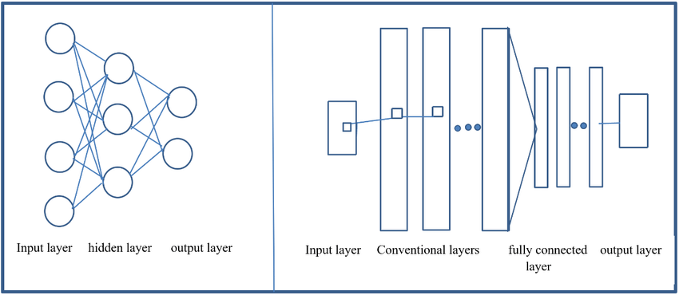

# Chapter 10: Convolutional Neural Networks (CNNs)

Convolutional Neural Networks (CNNs) are powerful models designed to process structured data like images, time-series, and signals.  
This chapter introduces the core building blocks of CNNs, their motivation, and how they address key limitations of fully connected networks.

  

