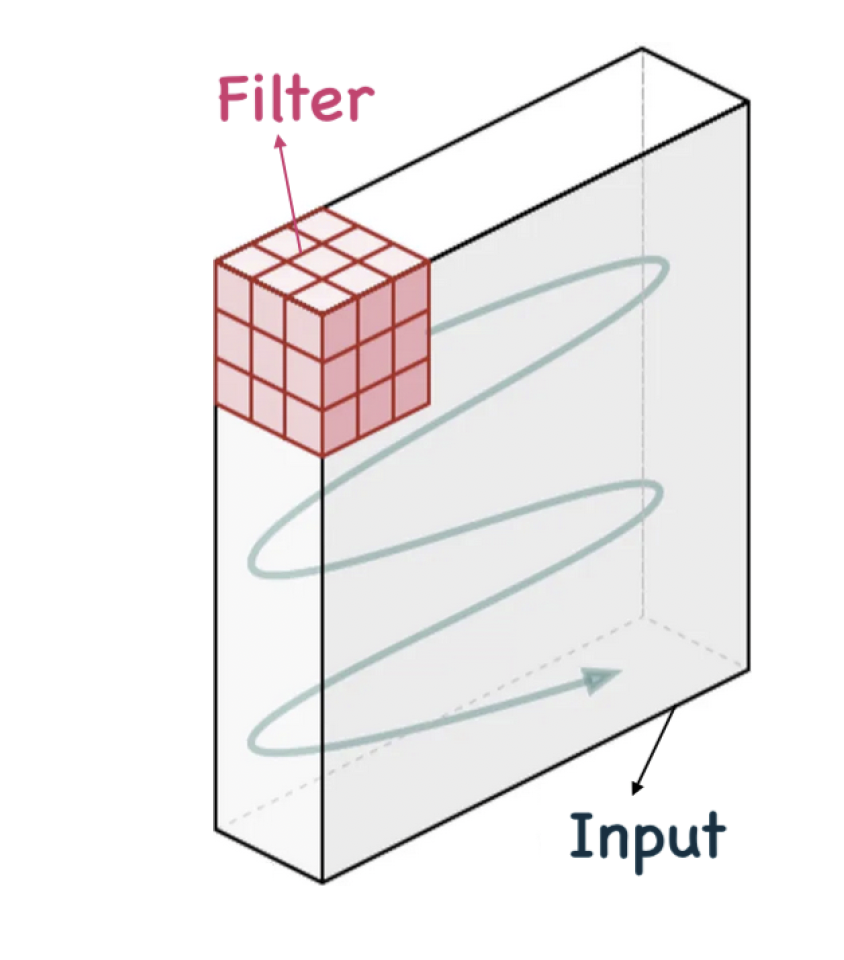

# Parameter Sharing in Convolutional Layers

Convolutional layers apply the same filter (weights) across different input locations.  
This concept is called **parameter sharing**.

---

**What It Means**

The same set of weights (a filter) is used across the entire input.  
For example, a $3 \times 3$ edge detector is applied at every location to detect edges.

  

---

**Why It Matters**

- Reduces number of parameters significantly  
- Allows detection of the same pattern anywhere in the input  
- Supports **translation invariance**

