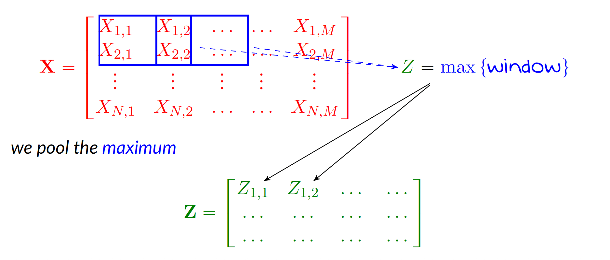

# Pooling Layers

Pooling layers are used to **downsample** feature maps, reducing their spatial size while preserving the most important information.  
They make the network more efficient and robust to small translations in the input.

---

**Max Pooling**

The most common pooling operation is **max pooling**, which selects the maximum value from a small patch:

- For example, a $2 \times 2$ max pool with stride 2 takes the maximum of each non-overlapping $2 \times 2$ region.
- Reduces spatial size by a factor of 2.

This retains strong activations and helps focus on dominant features.

  

---

**Average Pooling**

**Average pooling** computes the average value in each patch:

- Less aggressive than max pooling  
- Can be used when smoothing is preferred over sharp detection

Historically used in older models, but now less common than max pooling.

---

**Why Pooling Helps**

Pooling improves CNN performance by:

- Reducing feature map dimensions (fewer computations)  
- Introducing **translation invariance** (shifts in input don’t change output much)  
- Acting as a form of **regularization** (less chance of overfitting)

---

**Global Pooling**

In deep layers or for classification, **global average pooling** is used to collapse the entire feature map into a single value:

- Output shape becomes $(1, 1, C)$ for $C$ channels  
- Common in architectures like ResNet before the final fully connected layer

