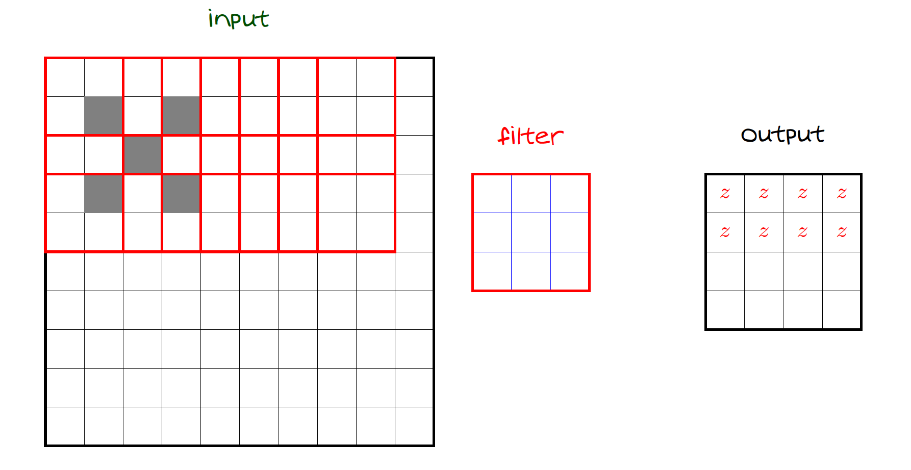

# Stride and Padding

The convolution operation has two key hyperparameters that affect the size of the output:  
**stride** and **padding**.

---

**Stride**

Stride defines how much the filter moves at each step across the input.

- **Stride = 1**: filter moves one pixel at a time → dense output  
- **Stride = 2**: skips every other pixel → spatial size reduces faster

For input of size $N$ and filter size $k$, with stride $s$, the output size (1D case) is:

$$
\left\lfloor \frac{N - k}{s} \right\rfloor + 1
$$

Larger strides reduce the spatial resolution of the feature maps.

  

---

**Padding**

Padding adds a border of zeros around the input to control output size and preserve spatial dimensions.

- **Valid padding**: no padding → output size shrinks  
- **Same padding**: adds enough zeros so output has same size as input (when stride = 1)

In 2D, to keep output size same as input, use:

$$
\text{Padding} = \left\lfloor \frac{k - 1}{2} \right\rfloor
$$

This keeps edge pixels from being ignored in early layers.

---

**Combined Effect**

The choice of stride and padding controls:

- Spatial **size** of the output  
- **Receptive field** growth over layers  
- Computational cost and number of parameters

Careful tuning is needed to balance resolution, efficiency, and depth.

