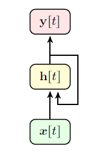
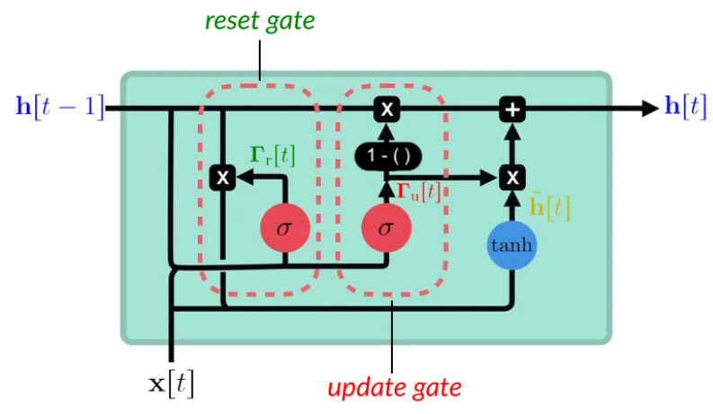
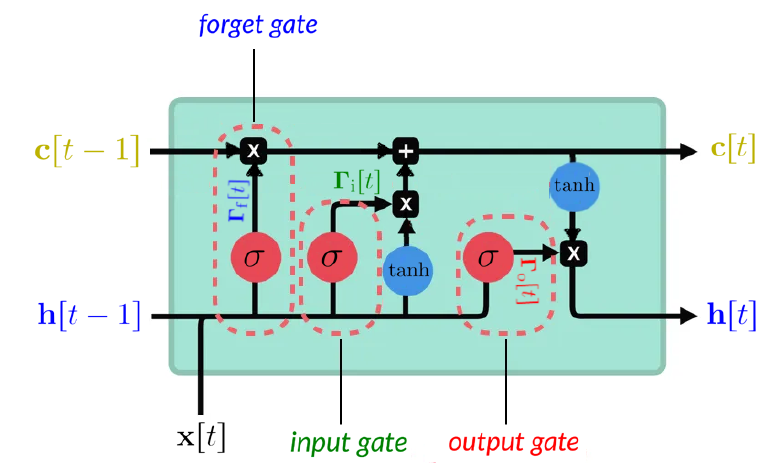

# Recurrent Neural Networks (RNNs)

**Recurrent Neural Networks (RNNs)**

Recurrent neural networks process sequences by maintaining a hidden state that evolves over time.  
At each step $t$, the model receives input $x[t]$ and the previous hidden state $h[t-1]$.

The recurrence is:

$$
h[t] = f(W_x x[t] + W_h h[t-1] + b_h)
$$

$$
y[t] = f(W_y h[t] + b_y)
$$

Unrolling the recurrence forms a chain:

$$
h[1] \rightarrow h[2] \rightarrow \dots \rightarrow h[T]
$$

  

Training uses backpropagation through time.  
Gradients pass through repeated transformations:

$$
\frac{\partial \mathcal{L}}{\partial h[t]} =
\frac{\partial \mathcal{L}}{\partial h[t+1]}
\cdot
\frac{\partial h[t+1]}{\partial h[t]}
$$

Repeated multiplication causes vanishing or exploding gradients.

---

**Gated Recurrent Units (GRU)**

GRUs use gates to control how information flows through time.

Update gate:

$$
z[t] = \sigma(W_{zx} x[t] + W_{zh} h[t-1])
$$

Reset gate:

$$
r[t] = \sigma(W_{rx} x[t] + W_{rh} h[t-1])
$$

Candidate hidden state:

$$
\tilde{h}[t] =
\tanh\!\left(W_{hx} x[t] + W_{hh}(r[t] \odot h[t-1])\right)
$$

Final hidden state:

$$
h[t] = (1 - z[t]) \odot h[t-1] + z[t] \odot \tilde{h}[t]
$$

The update gate controls how much of the old state is kept,  
the reset gate determines how much past information influences the candidate,  
and the final state blends old and new content.

  

---

**Long Short-Term Memory (LSTM)**

LSTMs introduce a cell state $c[t]$ to store long-term information using three gates and a candidate update.

Forget gate:

$$
f[t] = \sigma(W_{fx} x[t] + W_{fh} h[t-1])
$$

Input gate:

$$
i[t] = \sigma(W_{ix} x[t] + W_{ih} h[t-1])
$$

Candidate cell content:

$$
\tilde{c}[t] = \tanh(W_{cx} x[t] + W_{ch} h[t-1])
$$

Cell state update:

$$
c[t] = f[t] \odot c[t-1] + i[t] \odot \tilde{c}[t]
$$

Output gate:

$$
o[t] = \sigma(W_{ox} x[t] + W_{oh} h[t-1])
$$

Hidden state:

$$
h[t] = o[t] \odot \tanh(c[t])
$$

Gating allows the LSTM to decide what to forget, what to store, and what to output, enabling robust long-term memory.

  

