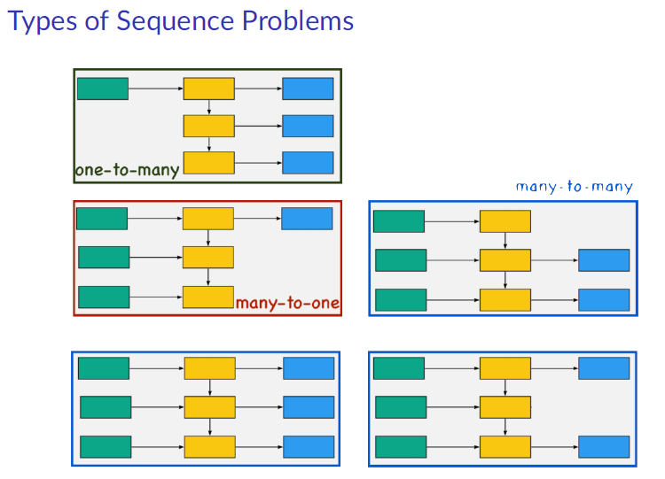

# Sequence Modeling Tasks

**Sequence Modeling Tasks**

Sequence learning problems differ based on how inputs and outputs are structured.  
The main task types are defined by how many elements of the sequence are consumed or produced by the model.

**Many-to-one**

A full input sequence is mapped to a single output.  
Examples include classifying a sentence, analyzing a time series, or predicting a label from a sequence of observations.

**One-to-many**

A single input produces a sequence.  
A model generates a series of outputs step by step, such as producing a caption or generating future frames from an initial signal.

**Many-to-many (aligned)**

Each input step corresponds directly to an output step.  
This structure appears in tasks like sequence tagging or per-time-step prediction, where every element receives a label or value.

**Many-to-many (unaligned)**

The input and output sequences have different lengths and do not match step by step.  
This is common in translation or conversion tasks, where the entire input sequence is encoded before producing an output sequence.

These task structures define how information flows through time and guide the design of models that process sequences efficiently.

  

