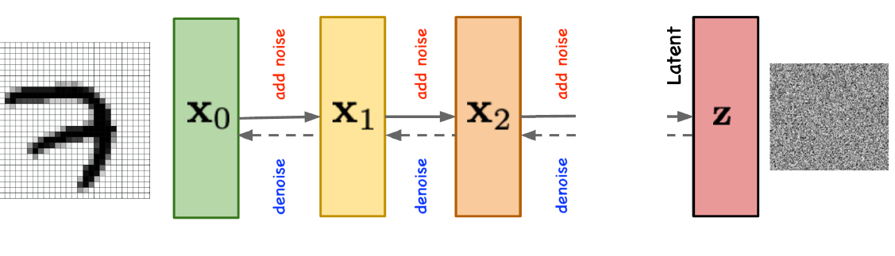

# Diffusion Models

**Diffusion Models**

Diffusion models generate data by learning a *reverse* process that transforms noise into structured samples.  
They are built around two key ideas:

1. A **forward diffusion** that gradually corrupts data with noise.  
2. A **reverse diffusion** learned by a model that reconstructs data step by step.

---

**Forward Diffusion Process**

The forward process gradually adds Gaussian noise to data:

$$
x_t = \sqrt{\alpha_t}\, x_{t-1} + \sqrt{1 - \alpha_t}\, \epsilon,
\qquad \epsilon \sim \mathcal{N}(0, I)
$$

This continues until $x_T$ becomes nearly pure noise.  
The sequence $\{\alpha_t\}$ controls how much noise is added at each step.

---

**Reverse Denoising Process**

The model learns a reverse mapping:

$$
x_{t-1} = g_{\theta}(x_t, t)
$$

The objective is to approximate the true reverse conditional distribution:

$$
p(x_{t-1} \mid x_t)
$$

Training typically minimizes a noise-prediction loss:

$$
\min_{\theta}\; 
\mathbb{E}\left[
\left\| 
\epsilon - \epsilon_{\theta}(x_t, t) 
\right\|^2
\right]
$$

where $\epsilon_{\theta}$ predicts the noise added at step $t$.

  

---

**Sampling (Generation)**

To generate a sample:

1. Draw pure noise  
   $$x_T \sim \mathcal{N}(0, I)$$
2. Iteratively apply the reverse process  
   $$x_{t-1} = g_{\theta}(x_t, t)$$
3. After $T$ steps, obtain a clean synthetic sample $x_0$

---

Diffusion models produce high-quality samples and are widely used in image, audio, and scientific generation tasks due to their stability and strong likelihood-based foundations.
