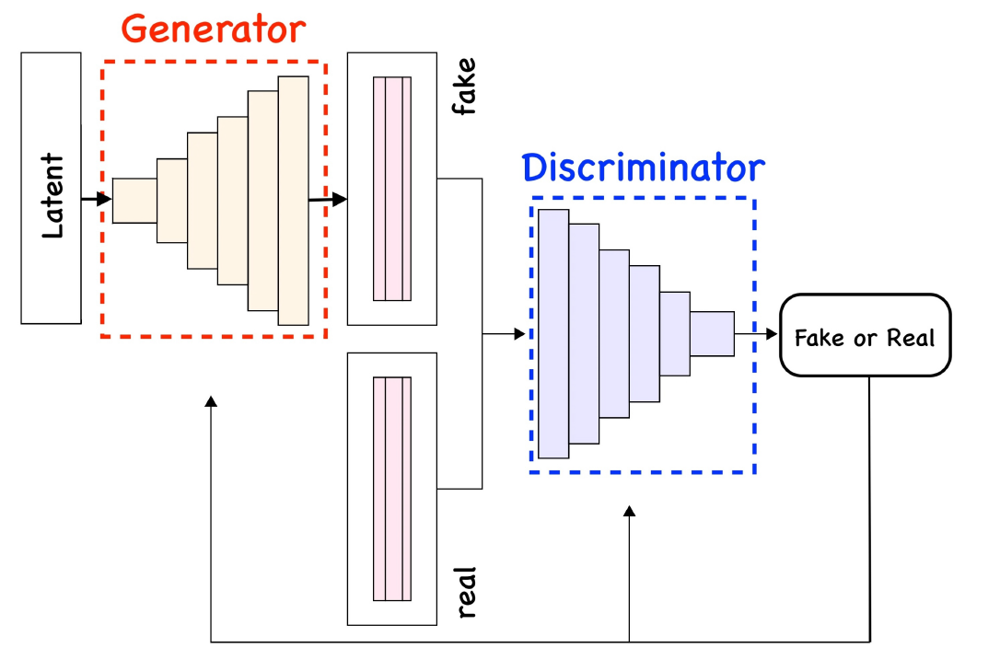

# Generative Adversarial Networks (GANs)

**Generative Adversarial Networks (GANs)**

Generative Adversarial Networks learn to generate data by setting up a two-player game between a **generator** and a **discriminator**.  
The generator tries to produce synthetic samples, while the discriminator tries to distinguish real data from generated data.

The generator maps noise $z$ to synthetic data:

$$
x_{\text{fake}} = G_{\theta}(z), 
\qquad z \sim p(z)
$$

The discriminator outputs a probability that its input is real:

$$
D_{\phi}(x) \in [0,1]
$$

  

---

**Min–Max Objective**

GANs are trained using the following adversarial loss:

$$
\min_{\theta}\, \max_{\phi}\;
\mathbb{E}_{x \sim p_{\text{data}}(x)}
\big[\log D_{\phi}(x)\big]
+
\mathbb{E}_{z \sim p(z)}
\big[\log(1 - D_{\phi}(G_{\theta}(z)))\big]
$$

The discriminator’s goal is to maximize correct classification, while the generator’s goal is to fool the discriminator.

---

**Generator Update**

The generator improves by maximizing:

$$
\mathbb{E}_{z \sim p(z)}
\big[\log D_{\phi}(G_{\theta}(z))\big]
$$

which encourages synthetic samples to be indistinguishable from real ones.

---

**Training Dynamics**

GAN training alternates between:

1. **Updating the discriminator**  
   to better separate real and fake samples

2. **Updating the generator**  
   to produce more realistic samples that fool the discriminator

This competition drives the generator toward modeling the true data distribution.

---

**Generation**

Once training converges, generating new data is simple:

$$
z \sim p(z),
\qquad 
x_{\text{new}} = G_{\theta}(z)
$$

GANs learn to sample directly from the data distribution and can generate high-quality images, signals, or other structured data.

