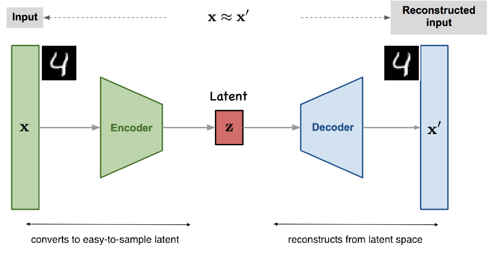

# Variational Autoencoders (VAEs)

**Variational Autoencoders (VAEs)**

Variational Autoencoders are latent-variable generative models that learn a probabilistic mapping between data $x$ and latent variables $z$.  
The model defines a joint distribution

$$
p_{\theta}(x, z) = p_{\theta}(z)\, p_{\theta}(x \mid z)
$$

with a simple prior, typically

$$
p_{\theta}(z) = \mathcal{N}(0, I).
$$

Direct maximum likelihood is intractable because computing

$$
p_{\theta}(x) = \int p_{\theta}(x \mid z)\, p_{\theta}(z)\, dz
$$

is difficult.  
VAEs address this by introducing an approximate posterior

$$
q_{\phi}(z \mid x)
$$

implemented by an encoder network.

  

---

**Evidence Lower Bound (ELBO)**

Instead of maximizing $\log p_{\theta}(x)$ directly, VAEs maximize its lower bound:

$$
\mathcal{L}(x) = 
\mathbb{E}_{q_{\phi}(z \mid x)}[\log p_{\theta}(x \mid z)]
-
D_{\text{KL}} \big(q_{\phi}(z \mid x)\, \|\, p_{\theta}(z) \big)
$$

This decomposes into:

- a **reconstruction term**, encouraging accurate decoding  
- a **regularization term**, pushing $q_{\phi}(z \mid x)$ toward the prior

Training optimizes:

$$
\theta^{*}, \phi^{*} = 
\arg\max_{\theta, \phi} 
\sum_{i=1}^{N} \mathcal{L}(x^{(i)})
$$

---

**Reparameterization Trick**

To make gradients flow through stochastic sampling, the latent variable is written as:

$$
z = \mu_{\phi}(x) + \sigma_{\phi}(x) \odot \epsilon,
\qquad
\epsilon \sim \mathcal{N}(0, I)
$$

This allows backpropagation through the encoder.

---

**Generation**

After training, VAEs generate synthetic data by:

1. Sampling  
   $$z \sim \mathcal{N}(0, I)$$  
2. Decoding  
   $$x_{\text{new}} \sim p_{\theta}(x \mid z)$$

VAEs learn smooth latent spaces and provide stable, probabilistic generation with explicit control of the latent distribution.
