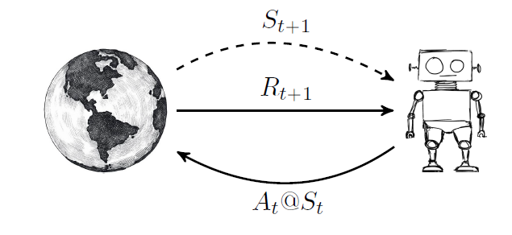

# Reward Signal and Return

**Reward Signal and Return**

The reward signal provides immediate feedback about the quality of an action taken in a particular state.  
At time $t$, after taking action $a_t$ in state $s_t$, the agent receives a scalar reward:

$$
r_{t+1} = R(s_t, a_t)
$$

  

The reward reflects short-term gain, but reinforcement learning focuses on the **long-term return** accumulated over time.

The discounted return from time $t$ is:

$$
G_t = \sum_{k=0}^{\infty} \gamma^k r_{t+k+1}
$$

where $\gamma \in [0,1]$ controls the importance of future rewards.

- If $\gamma$ is close to 0, the agent prioritizes immediate rewards.  
- If $\gamma$ is close to 1, future rewards matter strongly.

Return captures the total future reward the agent expects to obtain after time $t$.  
The goal in RL is to select actions that maximize expected return:

$$
\max_{\pi} \; \mathbb{E}[G_t \mid \pi]
$$

The reward signal drives learning, while return defines what the agent tries to maximize.
